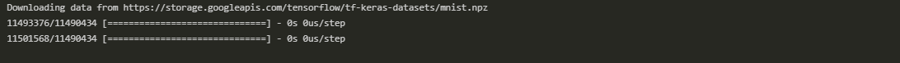
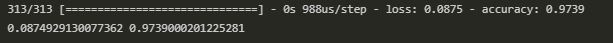
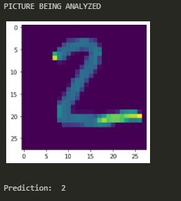

# MNIST

The MNIST database is a large database of handwritten digits that is commonly used for training various image processing systems. In this project you will see how I train an NN model to decipher hand written numbers with an accuracy of 97%

## Python 3 requirements

-   pip3 install jupyter
-   pip3 install tensorflow

## Training process (Read comments on jupyter notebook detailed explanation)

## Evaluation with test data

## Result

